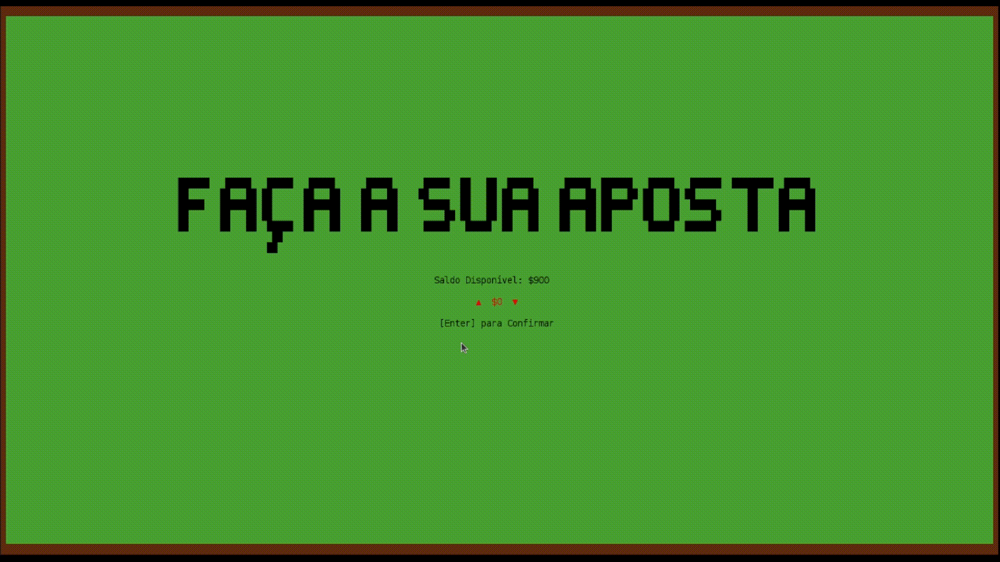
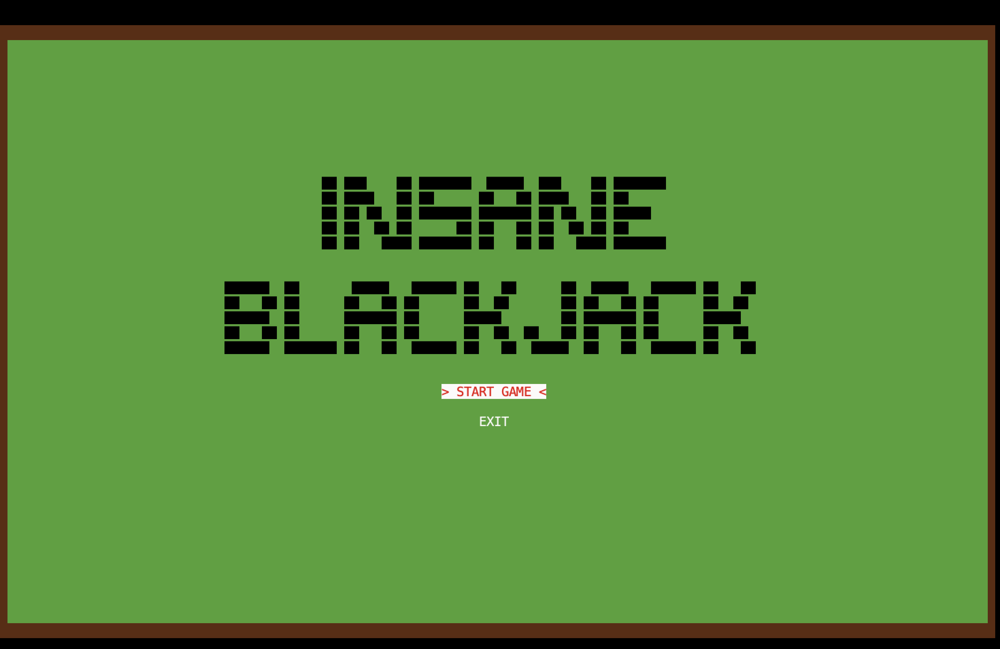
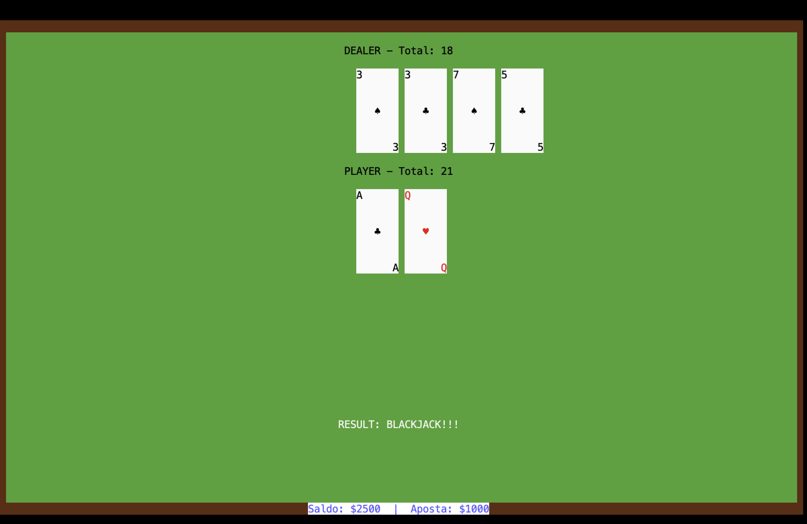
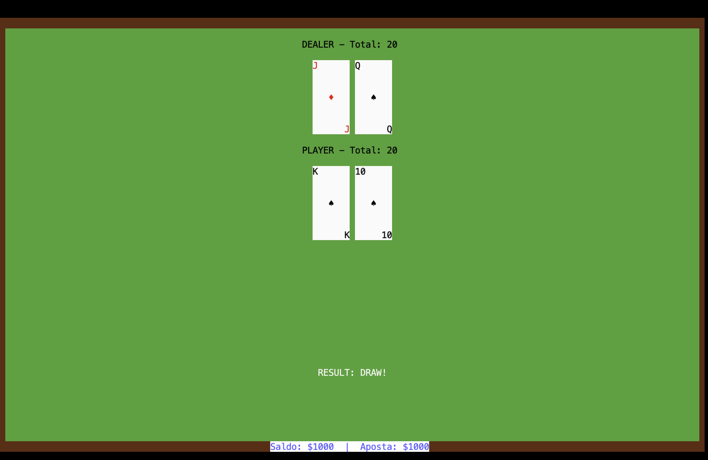
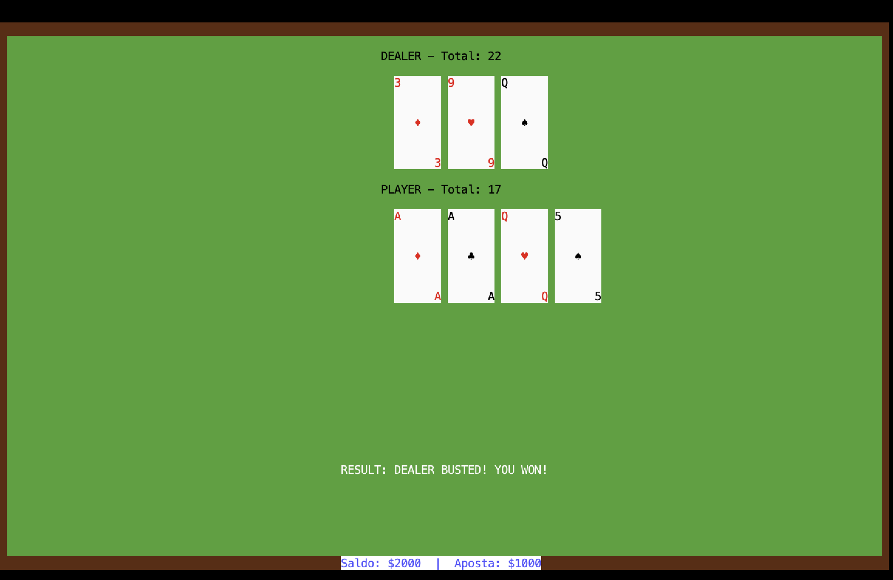

## LDTS_<11><08> - <Blackjack>

Neste projeto, iremos desenvolver uma versao digital do clássico jogo de cartas "Blackjack". Este vai consistir, principalmente, na mecânica de distribuição de cartas ao jogador e ao dealer, seguindo as regras tradicionais.
Este projeto foi desenvolvido por Nuno Sousa (up202404498@up.pt) e Guilherme Pinho (up202407213@up.pt) para LDTS 2025/2026.

Para mais informações clique [aqui](./docs/README.md).

## Screenshots

As seguintes capturas de ecrã mostram, de forma geral, como o nosso jogo é e como funciona em execução.

### Game preview

  

  <b><i>Gif 1. Sneak peak into a Blackjack round</i></b>

 
 

### Menus

  

  <b><i>Fig 1. Main Menu </i></b>

  

 
 

  

  <b><i>Fig 2. Betting Selection Menu </i></b>  

  

 
 

### Gameplay

  

  <b><i>Fig 4. Player decision (Hit or Stand) </i></b>

 
 

  

  <b><i>Fig 4. Player decision (Play Again or Exit) </i></b>

 
 

### End Game

  

  <b><i>Fig 5. Player hits Blackjack </i></b>

    
 
 

  

  <b><i>Fig 6. Draw message </i></b>

 
 

  

  <b><i>Fig 7. PlayerWon message </i></b>

 
 

  

  <b><i>Fig 8. PlayerBusted message </i></b>

  

  <b><i>Fig 9. DealerWon message </i></b>

 
 

  

  <b><i>Fig 10. DealerBusted message </i></b>

